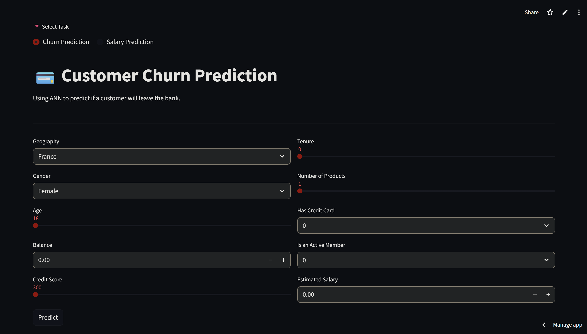
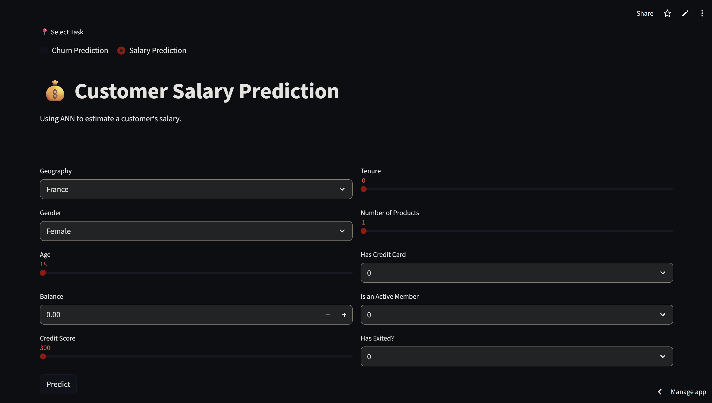

# 💳 Customer Churn & Salary Prediction Platform

An end-to-end Deep Learning application that leverages **Artificial Neural Networks (ANN)** to perform two distinct tasks: predicting customer churn (Classification) and estimating customer salary (Regression) from a dataset of 10,000+ bank records.

## 🚀 Live Demo
[Click here to view the live app on Streamlit Cloud](https://customer-churn-prediction-011.streamlit.app/)
<table sorted>
  <tr>
    <td align="center">
      
    </td>
    <td align="center">
      
    </td>
  </tr>
</table>

## 📌 Project Overview
This project demonstrates a full machine learning lifecycle, from data preprocessing and hyperparameter optimization to deploying a multi-task web application.

### Key Features:
- **Dual-Model Support:** Toggle between a **Churn Predictor** (Binary Classification) and a **Salary Estimator** (Regression).
- **Real-Time Inference:** Instant predictions based on user-input demographic and financial data.
- **Robust Pipeline:** Automated data scaling and encoding (Label & One-Hot) synchronized across training and deployment.
- **Cloud Optimized:** Configured for high performance on Streamlit Cloud with custom environment synchronization.

## 🛠️ Tech Stack
- **Deep Learning:** TensorFlow, Keras
- **Data Processing:** Scikit-Learn, Pandas, NumPy
- **Deployment:** Streamlit, GitHub
- **Version Control:** Git

## 📊 Model Performance
- **Churn Prediction:** Achieved **86.1% accuracy** on the validation set after 47+ iterations.
- **Salary Estimation:** Optimized using Mean Absolute Error (MAE) for precise financial forecasting.

## 📂 Project Structure
```text
├── Churn_Modelling.csv         # Dataset used
├── app.py                      # Main Streamlit application
├── classificationmodel.h5      # Trained Churn Classification model
├── regressionmodel.h5          # Trained Salary Regression model
├── class_scaler.pkl            # Scaler for churn model
├── reg_scaler.pkl              # Scaler for salary model
├── label_encoder_gender.pkl    # Gender encoder
├── one_hot_encoder_geo.pkl     # Geography encoder
├── churnclassification.ipynb   # Churn prediction experiments file
├── salaryregression.ipynb      # Salary prediction experiments file
├── requirements.txt            # Python dependencies
└── .python-version             # Environment configuration (v3.10)
```

## ⚙️ Installation & Local Setup

1. **Clone the repository:**
   ```bash
   git clone [https://github.com/anantj09/Customer-Churn-Prediction.git](https://github.com/anantj09/Customer-Churn-Prediction.git)
   cd Customer-Churn-Prediction
   ```
2. **Create a virtual environment:**
   ```bash
   python -m venv venv
   # On Windows:
   .\venv\Scripts\activate
   # On macOS/Linux:
   source venv/bin/activate
   ```
3. **Install dependencies:**
   ```bash
   pip install -r requirements.txt
   ```
4. **Run the application:**
   ```bash
   streamlit run app.py
   ```

## 📝 Author - **Anant Jain**

[](https://www.linkedin.com/in/anant-jain09/)
[](https://github.com/anantj09)

---

> **Note:** This is a minor project which was developed focusing on ANN optimization and production-level deployment.
